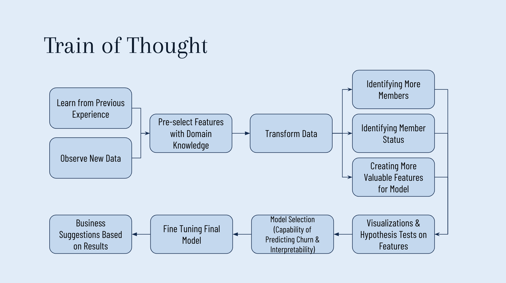

# Massage Business Member Churn Analysis

*This project is a member churn analysis for a small business client. As requested, the datasets provided will not be shared.*

## Provided Dataset Description
- Member: Partial member records with multiple demographics and membership-related data.
- Sales: Transaction details for massage items with member ID.
- Deposits: Transaction details for gift card items with member ID.
- Schedule: Schedule details for massage appointments with member ID.
- Therapist Metrics: Therapists' performance metrics with their names.
- Therapist Turnover: Therapists' monthly turnover with their names.

## Train of Thought

## Methods
### Dataset Preparation
[01DataPrep.ipynb](01DataPrep.ipynb)
1. Cleaned and merged datasets for data augmentation, feature mapping and extraction.
2. Used domain knowlegde to augment the member data and balance the churn and unchurn class.

### Feature Selection with EDA
[02EDA.ipynb](02EDA.ipynb)
1. Further selected features with visualizations and statistical tests.

### Model Selection
[03ModelCompareInterpret.ipynb](03ModelCompareInterpret.ipynb)
1. Built Logistic Regression, Decision Tree, Random Forest, SVM, and KNN classification models for comprehensive comparison and selected Logistic Regression model for its high recall and accuracy. 
2. Selected logistic regression without regularization as final model and achieved 100% recall for the churn class and 94% accuracy for both classes on the test set.

### Result Interpretation
[03ModelCompareInterpret.ipynb](03ModelCompareInterpret.ipynb)
1. Results were explained in business language.

## Results
### Model Input
- Dataset: Including demographics and buying behavior data for customers ever joined the membership.
- Dependent variable: Member_Status(Churn: 1, Unchurn: 0). 
- Independent variables:
  - Sale_Frequency: Collected from sales dataset; Calculated the count grouped by client.
  - Preferred_Service_Time: Collected from sales dataset; Split item name to get service time and used the mode grouped by client.
  - Favorite_Sales_Item: Collected from sales; Split item name to get service time and used the mode grouped by client.
  - Ever_Purchased_Manager_Owner_Session: Collected from sales; Split item names and countws 1 if the client ever purchased the Manager_Owner_Session.
  - Non_Member_Purchase_Rate: Collected from sales; Calculated by non-member sales count divided by total sales count.
  - Member_Next_Autopay_Amount: Collected from members; If missing, fill with 0.
  - Member_Age: Collected from schedule; 2024 - birth year; Removed age under 18 and over 80.
  - Membership_Duration: Last purchase date from sales minus Joined_On date.
  - Join_On_Month: Calculated from Joined_On date; Seasonality.

### Model Output
#### Model Selection

#### Final Model

### Interpretation
