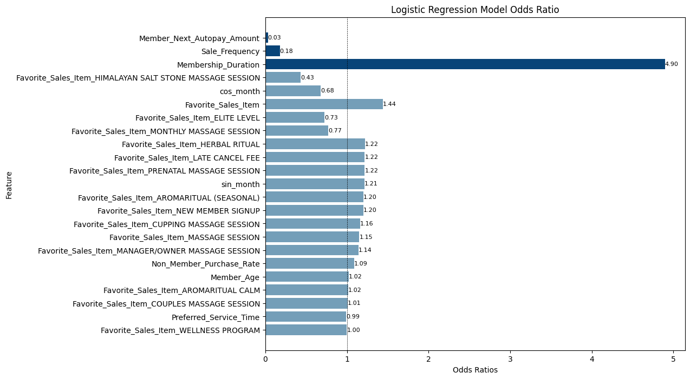

# Massage Business Member Churn Analysis

*This project is a member churn analysis for a small business client.*

*As requested, the datasets provided will not be shared.*

## 1. Provided Dataset Description
- **Member:** Partial member records with multiple demographics and membership-related data.
- **Sales:** Transaction details for massage items with member ID.
- **Deposits:** Transaction details for gift card items with member ID.
- **Schedule:** Schedule details for massage appointments with member ID.
- **Therapist Metrics:** Therapists' performance metrics with their names.
- **Therapist Turnover:** Therapists' monthly turnover with their names.

## 2. Train of Thought

## 3. Dataset Preparation
[01DataPrep.ipynb](01DataPrep.ipynb)
- Cleaned and merged datasets for data augmentation, feature mapping and extraction.
- Used domain knowlegde to augment the member data and balance the churn and unchurn class.

## 4. Feature Selection with EDA
[02EDA.ipynb](02EDA.ipynb)
- Further selected features with visualizations and statistical tests.

## 5. Modeling
[03ModelCompareInterpret.ipynb](03ModelCompareInterpret.ipynb)

### 5.1 Model Input
- **Dataset:** Including demographics and buying behavior data for customers ever joined the membership.
- **Dependent variable:** Member_Status(Churn: 1, Unchurn: 0). 
- **Independent variables:**
  - **Sale_Frequency:** Collected from sales dataset; Calculated the count grouped by client.
  - **Preferred_Service_Time:** Collected from sales dataset; Split item name to get service time and used the mode grouped by client.
  - **Favorite_Sales_Item:** Collected from sales; Split item name to get service time and used the mode grouped by client.
  - **Ever_Purchased_Manager_Owner_Session:** Collected from sales; Split item names and countws 1 if the client ever purchased the Manager_Owner_Session.
  - **Non_Member_Purchase_Rate:** Collected from sales; Calculated by non-member sales count divided by total sales count.
  - **Member_Next_Autopay_Amount:** Collected from members; If missing, fill with 0.
  - **Member_Age:** Collected from schedule; 2024 - birth year; Removed age under 18 and over 80.
  - **Membership_Duration:** Last purchase date from sales minus Joined_On date.
  - **Join_On_Month:** Calculated from Joined_On date; Seasonality.

### 5.2 Model Selection
- Built Logistic Regression, Decision Tree, Random Forest, SVM, and KNN classification models for comprehensive comparison and selected Logistic Regression model for its high recall and accuracy.

- Selected logistic regression without regularization as final model and achieved 100% recall for the churn class and 94% accuracy for both classes on the test set.

### 5.3 Final Model

#### Classification report for training set

|                  | precision | recall | f1-score | support |
|------------------|-----------|--------|----------|---------|
| 0                | 0.99      | 0.91   | 0.95     | 654     |
| 1                | 0.93      | 0.99   | 0.96     | 845     |
|                  |           |        |          |         |
| **accuracy**     |           |        | 0.95     | 1499    |
| **macro avg**    | 0.96      | 0.95   | 0.95     | 1499    |
| **weighted avg** | 0.96      | 0.95   | 0.95     | 1499    |

#### Classification report for test set

|                  | precision | recall | f1-score | support |
|------------------|-----------|--------|----------|---------|
| 0                | 1.00      | 0.87   | 0.93     | 270     |
| 1                | 0.92      | 1.00   | 0.96     | 373     |
|                  |           |        |          |         |
| **accuracy**     |           |        | 0.95     | 643     |
| **macro avg**    | 0.96      | 0.94   | 0.94     | 643     |
| **weighted avg** | 0.95      | 0.95   | 0.94     | 643     |

#### Confusion matrix

### 5.4 Result Interpretation
[03ModelCompareInterpret.ipynb](03ModelCompareInterpret.ipynb)

- Plot model coefficient and calculated odds ratio for the all features

- Interpreted the results with business language 
