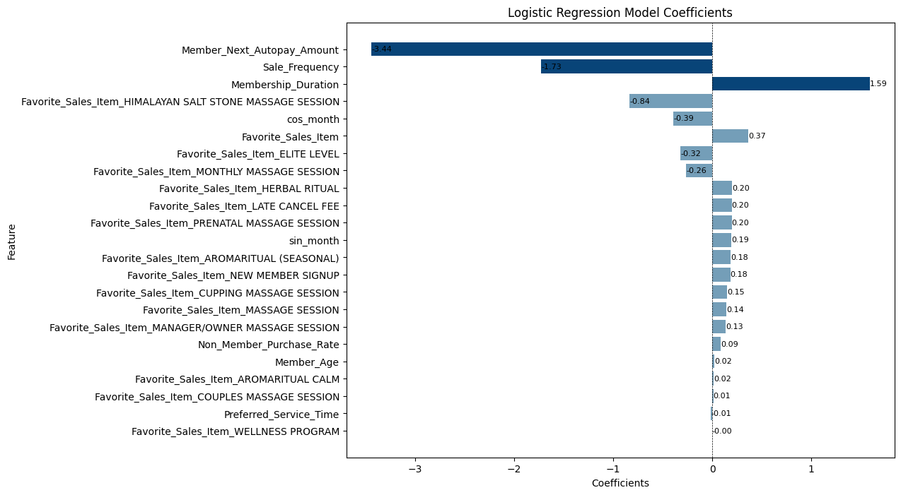

# Massage Business Member Churn Analysis

*This project is a member churn analysis for a small business client.*

*As requested, the datasets provided will not be shared.*

## 1. Provided Dataset Description
- **Member:** Partial member records with multiple demographics and membership-related data.
- **Sales:** Transaction details for massage items with member ID.
- **Deposits:** Transaction details for gift card items with member ID.
- **Schedule:** Schedule details for massage appointments with member ID.
- **Therapist Metrics:** Therapists' performance metrics with their names.
- **Therapist Turnover:** Therapists' monthly turnover with their names.

## 2. Train of Thought

## 3. Dataset Preparation
[01DataPrep.ipynb](01DataPrep.ipynb)
- Cleaned and merged datasets for data augmentation, feature mapping and extraction.
- Used domain knowlegde to augment the member data and balance the churn and unchurn class.

## 4. Feature Selection with EDA
[02EDA.ipynb](02EDA.ipynb)
- Further selected features with visualizations and statistical tests.

## 5. Modeling
[03ModelCompareInterpret.ipynb](03ModelCompareInterpret.ipynb)

### 5.1 Model Input
- **Dataset:** Including demographics and buying behavior data for customers ever joined the membership.
- **Dependent variable:** Member_Status(Churn: 1, Unchurn: 0). 
- **Independent variables:**
  - **Sale_Frequency:** Collected from sales dataset; Calculated the count grouped by client.
  - **Preferred_Service_Time:** Collected from sales dataset; Split item name to get service time and used the mode grouped by client.
  - **Favorite_Sales_Item:** Collected from sales; Split item name to get service time and used the mode grouped by client.
  - **Ever_Purchased_Manager_Owner_Session:** Collected from sales; Split item names and countws 1 if the client ever purchased the Manager_Owner_Session.
  - **Non_Member_Purchase_Rate:** Collected from sales; Calculated by non-member sales count divided by total sales count.
  - **Member_Next_Autopay_Amount:** Collected from members; If missing, fill with 0.
  - **Member_Age:** Collected from schedule; 2024 - birth year; Removed age under 18 and over 80.
  - **Membership_Duration:** Last purchase date from sales minus Joined_On date.
  - **Join_On_Month:** Calculated from Joined_On date; Seasonality.

### 5.2 Model Selection
- Built Logistic Regression, Decision Tree, Random Forest, SVM, and KNN classification models for comprehensive comparison and selected Logistic Regression model for its high recall and accuracy.

- Selected logistic regression without regularization as final model and achieved 100% recall for the churn class and 94% accuracy for both classes on the test set.

### 5.3 Final Model

#### Classification report for training set

|                  | precision | recall | f1-score | support |
|------------------|-----------|--------|----------|---------|
| 0                | 0.99      | 0.91   | 0.95     | 654     |
| 1                | 0.93      | 0.99   | 0.96     | 845     |
|                  |           |        |          |         |
| **accuracy**     |           |        | 0.95     | 1499    |
| **macro avg**    | 0.96      | 0.95   | 0.95     | 1499    |
| **weighted avg** | 0.96      | 0.95   | 0.95     | 1499    |

#### Classification report for test set

|                  | precision | recall | f1-score | support |
|------------------|-----------|--------|----------|---------|
| 0                | 1.00      | 0.87   | 0.93     | 270     |
| 1                | 0.92      | 1.00   | 0.96     | 373     |
|                  |           |        |          |         |
| **accuracy**     |           |        | 0.95     | 643     |
| **macro avg**    | 0.96      | 0.94   | 0.94     | 643     |
| **weighted avg** | 0.95      | 0.95   | 0.94     | 643     |

#### Confusion matrix

## 6. Result Interpretation
[03ModelCompareInterpret.ipynb](03ModelCompareInterpret.ipynb)

### 6.1 Result Display
#### Model Coefficients

- **Positive Coefficient:** Indicates an increase in the log-odds of the outcome (churn) as the predictor increases.
- **Negative Coefficient:** Indicates a decrease in the log-odds of the outcome (churn) as the predictor increases.
- **Member_Next_Autopay_Amount (Coefficient -3.44):** The actual coefficient is negative, which means that as the next autopay amount increases, the likelihood of churn actually decreases.

#### Odds Ratio

- **Odds Ratio > 1:** Indicates that as the predictor increases, the odds of the outcome (churn) occurring increase.
- **Odds Ratio < 1:** Indicates that as the predictor increases, the odds of the outcome (churn) occurring decrease.

- **Member_Next_Autopay_Amount (Odds Ratio: 0.032):** This is significantly less than 1, indicating a strong negative relationship with churn. For each unit increase in the autopay amount, the odds of a customer churning decrease by about 97%.
- **Sale_Frequency (Odds Ratio: 0.178):** Also less than 1, showing a negative relationship with churn. An increase in sale frequency is associated with an 82% decrease in the odds of churn.
- **Membership_Duration (Odds Ratio: 4.90):** This is substantially greater than 1, which is typically interpreted as a customer with longer membership duration having nearly 5 times the odds of churning compared to those with shorter durations, all else being equal.
- **Favorite_Sales_Item_HIMALAYAN SALT STONE MASSAGE SESSION (Odds Ratio: 0.433):** An odds ratio less than 1 means customers whose favorite item is the Himalayan salt stone massage session are less likely to churn.
- **cos_month (Odds Ratio: 0.677):** As the cosine of the last sale month increases (which happens as we move from January and December towards June), the likelihood of churn decreases. The months in the middle of the year are associated with lower churn rates than those at the beginning and end of the year.
- **Favorite_Sales_Item (Odds Ratio: 1.44):** Indicates a positive relationship with churn. If this item is a customer's favorite, they are 44% more likely to churn.

### 6.2 Business Suggestions
1. Given that a higher `Member_Next_Autopay_Amount` is strongly associated with decreased churn, it suggests that customers committing to higher autopay amounts are less likely to churn. However, since the relationship is negative, it's also possible that high payments could be a burden leading to churn, so consider introducing tiered pricing or discounts for longer commitments to appeal to a broader customer base.
2. With `cos_month` having an odds ratio less than 1, this indicates a lower likelihood of churn around the mid-year months. Use this insight to engage customers with mid-year promotions, loyalty rewards, or appreciation events, capitalizing on this period to solidify retention.
3. The high odds ratio for `Membership_Duration` is unusual as it suggests longer-duration members are more likely to churn. Dive deeper to understand the underlying reasons—could it be service fatigue or competitive offers? Tailoring retention offers for different member segments based on their membership lifecycle could mitigate this.
4. Lower `sale frequency` seems to correlate with lower churn. This could indicate that too many sales might overwhelm or devalue the service for customers. Streamline your sales and promotions calendar to avoid potential customer fatigue.
5. Look into the negative association of certain services (like `Favorite_Sales_Item_HIMALAYAN SALT STONE MASSAGE SESSION`) with churn. If these services are favored by customers less likely to churn, consider upselling them or bundling them with other offers to enhance perceived value.
6. With `Favorite_Sales_Item` having a positive coefficient, indicating that specific preferences could lead to higher churn, identify and target these customer groups with specialized retention campaigns.
7. The `sin_month` feature indicates potential month-to-month variability in churn. Customize your marketing efforts to be more aggressive during high-risk months identified by the model.
8. Although `Member_Age` has a minimal effect, monitor this to see if there are age-specific trends in churn that could inform targeted marketing or service adaptations.